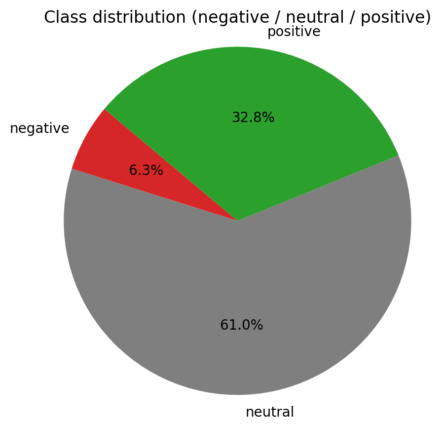
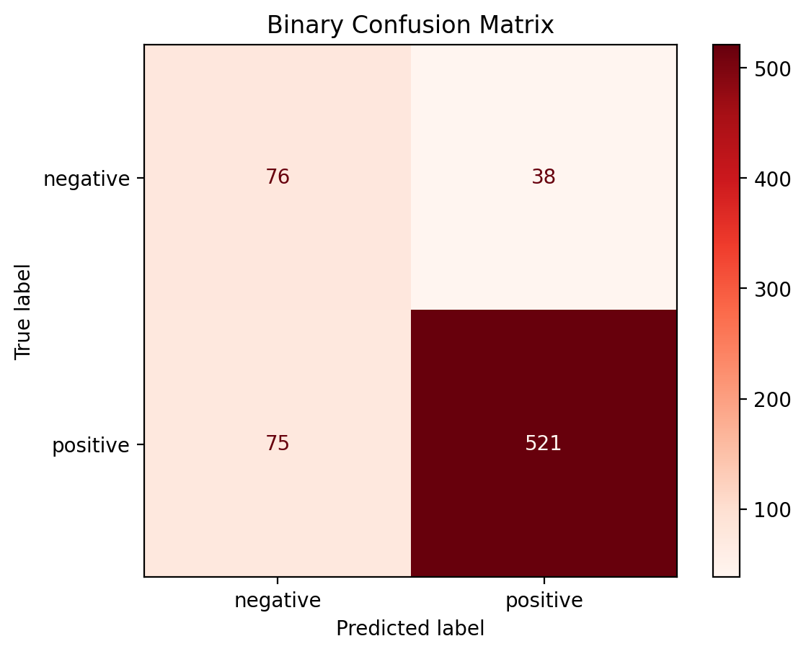
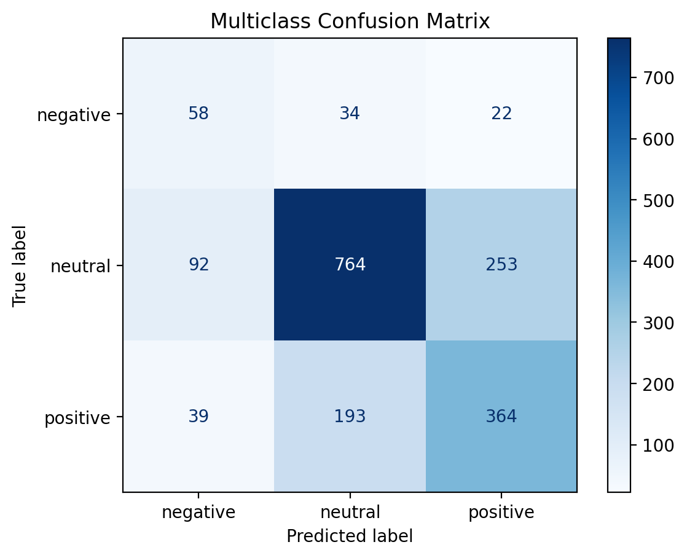
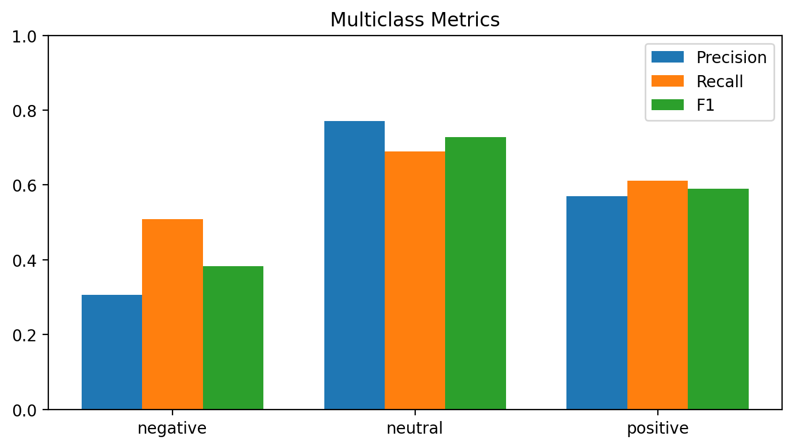

# NLP Sentiment Analysis


# Project Title  
**Apple vs Google: Tweet Sentiment Classification (Negative / Neutral / Positive)**

## Overview  
This project analyzes public sentiment toward Apple and Google by classifying tweets as negative, neutral, or positive. It uses TF‑IDF features with Logistic Regression for an interpretable baseline, along with clear visualizations and a business‑friendly presentation.

## Business Understanding  
Understanding brand sentiment helps teams:
- Monitor brand reputation in real time
- Identify pain points to reduce churn and improve CX
- Measure campaign impact versus competitors

This project aims to:
- Quantify sentiment distribution (negative/neutral/positive)
- Compare binary (pos/neg) vs. multiclass (neg/neu/pos) performance
- Provide interpretable features and practical recommendations

## Data Understanding  
Dataset: labeled tweets mentioning Apple/Google.

Key columns:
- `tweet` (text), `sentiment` (target: negative/neutral/positive)
- Additional metadata (e.g., product mentions) depending on source

Class balance (typical):
- neutral ≫ positive ≫ negative (class imbalance is non‑trivial)

## Data Preparation  
- Remove URLs, mentions, hashtags, punctuation
- Lowercase; remove stopwords (NLTK)
- Build TF‑IDF vectors (max_features=5000)

## Modeling  
- Binary model: Logistic Regression (positive vs negative)
- Multiclass model: Logistic Regression (negative/neutral/positive)
- Stratified train/test split; `class_weight='balanced'` to mitigate skew

## Analysis and Results

### 🔹 Class Distribution  


### 🔹 Binary Confusion Matrix  


### 🔹 Multiclass Confusion Matrix  


### 🔹 Multiclass Metrics (Precision / Recall / F1)  


### ✅ Takeaways
- Neutral and positive are easier; negative recall is the main challenge (few examples + lexical overlap)
- Interpretable top words per class aid error analysis and data curation

## ✅ Recommendations & Next Steps
- Data: collect more negative examples; curate edge cases (sarcasm, irony)
- Features: add n‑grams/char‑grams; emoji/punctuation signals; consider lemmatization
- Models: compare LinearSVC, ComplementNB, and DistilBERT
- Thresholds: optimize per‑class thresholds for business goals (e.g., higher negative recall)
- Monitoring: log high‑confidence mistakes to guide ongoing labeling

## How to Run
1) Environment
```
python -m venv .venv
source .venv/bin/activate
pip install pandas numpy matplotlib seaborn nltk scikit-learn
```
2) Data: ensure `tweets_sentiment.csv` is in the project root
3) Notebook: open and run `notebook.ipynb` (or `notebook_dataset.ipynb`)
4) Figures: run the “Save figures to disk” cell to populate `figures/`

## Non‑Technical Presentation
- File: `Non-Technical Presentation.md`
- Export to PDF (option A – WeasyPrint):
```
python -m pip install weasyprint
pandoc "Non-Technical Presentation.md" -o "Non-Technical Presentation.pdf" --pdf-engine=weasyprint
```
- Export to PDF (option B – XeLaTeX):
```
brew install --cask mactex-no-gui
sudo tlmgr update --self --all
pandoc "Non-Technical Presentation.md" -o "Non-Technical Presentation.pdf" --pdf-engine=xelatex
```

## 📁 Repository Structure
```
├── figures/
│   ├── class_distribution_pie.png
│   ├── confusion_binary.png
│   ├── confusion_multiclass.png
│   └── metrics_multiclass.png
├── notebook.ipynb
├── tweets_sentiment.csv
├── Non-Technical Presentation.md
└── README.md
```

## Troubleshooting
- NLTK stopwords download: if blocked, download manually via `nltk.download('stopwords')`
- Missing figures: re‑run the model and “Save figures” cell
- Pandoc engine missing: use WeasyPrint or XeLaTeX options above, or “Print to PDF” from your editor

